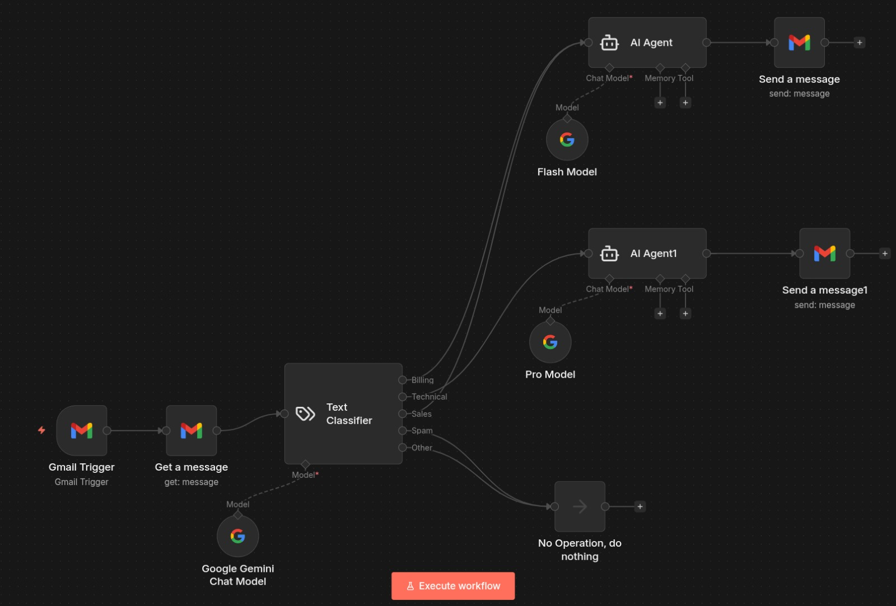
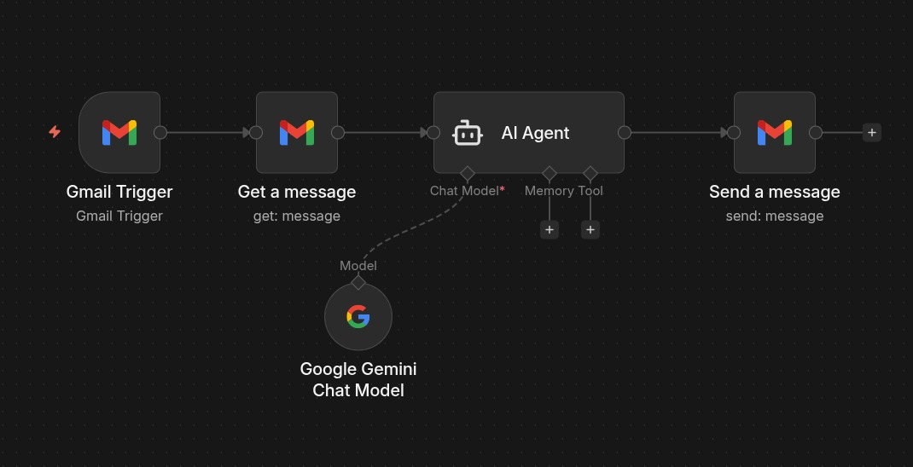

# GDGOC Workshop — n8n + Agentic AI Automation

This repository contains workflows and materials from a **Google Developer Group on Campus (GDGOC)** workshop where I was part of the **developer team** helping organize and support the session.

The workshop focused on **building real-world AI-powered automations using n8n**.

---

## 🚀 What This Workshop Covered

* Introduction to **n8n workflow automation**
* Connecting APIs and services without heavy coding
* Adding **Agentic AI (LLM-based decision making)** inside workflows
* Building **production-style automation use cases**

---

## 🧠 What is Agentic AI in Workflows?

Agentic AI means the AI:

* Understands context
* Makes decisions
* Chooses actions
* Produces outputs autonomously

Instead of just replying, the AI becomes a **decision-making node inside automation**.

---

# 🔧 Workflows in This Repository

## 1️⃣ AI Customer Support Automation

**File:** `workflows/customer-support-ai.json`

**What it does:**

* Reads incoming Gmail support emails
* Classifies issue (Billing / Technical / Sales / Spam / Other)
* AI Agent generates contextual replies
* Sends automated support responses

### 🔥 Upgrade to-do: Pinecone Vector Database

To make the system truly **agentic + memory-enabled**, a vector database layer is added:

**Architecture Upgrade:**

1. Email content → Converted to embeddings
2. Stored in **Pinecone vector database**
3. AI Agent retrieves similar past issues before replying
4. AI uses previous resolutions for better answers
5. Final solution summary is stored for future cases

➡ This turns the workflow into an **end-to-end intelligent support system** with memory.

---

## 2️⃣ Gmail AI Auto-Replier

**File:** `workflows/gmail-ai-replier.json`

**What it does:**

* Monitors Gmail inbox
* AI reads email subject + content
* Generates smart reply using Gemini
* Sends response automatically

Simple but powerful example of **AI-assisted email automation**.

---

## 3️⃣ Telegram Agentic AI Chatbot

**File:** `workflows/telegram-agentic-chatbot.json`

**What it does:**

* Telegram messages trigger workflow
* AI Agent processes user input
* Gemini model generates response
* Bot replies instantly

Shows how **conversational AI can be embedded into messaging platforms** using automation.

---

# 📸 Workshop Glimpse

### 🖼 Workshop Session

To-do: Add a Pinecone Vector Database for memory access to AI

G-Mail Auto-replier using the Google Gemini Flash Model

Telegram Auto-replier using the Google Gemini Chat Model

---

# 🛠 Tools & Technologies Used

* n8n (Workflow Automation)
* Google Gemini (LLM)
* Agent Nodes (LangChain-based agents)
* Gmail API
* Telegram Bot API
* Pinecone (Vector Database for AI memory)

---

# 🎯 Outcome

Participants learned how to:

* Design automation systems
* Integrate AI into workflows
* Build intelligent agents
* Understand practical AI + automation use cases

---

**Built during GDGOC Workshop**
